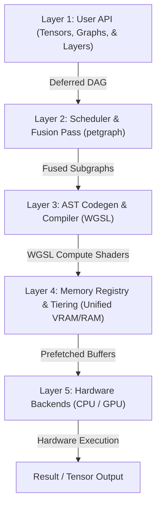

# Aether: High-Performance Heterogeneous Compute Runtime in Rust
## System Architecture & Technical Explanation Document

Welcome to the Aether technical documentation. This document is designed for the entire engineering team—from principal architects to junior developer interns—to understand the problem Aether solves, its architectural layers, the technical mechanics of how it optimizes compute workloads, and the design decisions behind it.

---

## 1. Executive Summary & The Problem

High-performance compute workloads (like machine learning, physics engines, or image processing pipelines) face a frustrating trade-off:
- **CPU Native**: Simple to write and debug, but slow and unable to scale to massively parallel matrix operations.
- **GPU Native (CUDA/WGSL)**: Orders of magnitude faster, but requires manual device memory allocation, manual synchronization, writing kernel codes, and managing data transfers (`cudaMemcpy`). Furthermore, if a dataset exceeds the GPU's physical memory (VRAM), the program crashes with an Out-of-Memory (OOM) error.

**Aether** solves this by providing a unified, deferred-execution DAG runtime in Rust. Developers define mathematical equations using simple high-level API tensor chains. Under the hood, Aether compiles, schedules, fuses, allocates, and runs the workload efficiently across CPU and GPU hardware.

---

## 2. System Architecture: The 5 Cohesive Layers

Aether is designed as a series of decoupled compiler and runtime layers. Here is how a user's instruction travels from source code to hardware execution:



### Layer 1: User API (Tensors, Graphs, & Layers)
- **Lazy DAG Building**: Tensors in Aether do not contain data immediately. Operations like `x.matmul(y)` return a `GraphTensor` which is just a pointer to a node in a Directed Acyclic Graph (DAG).
- **Reverse-Mode Autograd**: Aether tracks the history of all operations. Calling `.backward()` traverses the graph in reverse order, automatically building gradient operations for training neural networks.

### Layer 2: Scheduler & Fusion Pass
- **Topological Sorting**: Uses a directed graph scheduler powered by the `petgraph` library to analyze dependencies and establish a valid execution order.
- **Kernel Fusion**: Elementwise operations (like `add`, `mul`, `relu`) are chained together. Instead of executing 3 separate GPU passes and writing intermediate data back to VRAM 3 times, Aether fuses them into a single compile-time shader, saving memory bandwidth.

### Layer 3: AST Codegen & WGSL Compiler
- **Abstract Syntax Trees (AST)**: Aether parses fused elementwise loops into an AST and generates optimal WGSL (WebGPU Shading Language) code on the fly.
- **Pipeline Cache**: To prevent runtime lag, compiled shader modules are cached. If the same math is run again, Aether immediately reuse the pipeline.

### Layer 4: Memory Registry & Tiering
- **`BufferRegistry`**: Maps tensor IDs to virtual and physical buffers on the host CPU or device GPU.
- **Prefetch Scheduler**: Analyzes the execution plan ahead of time and initiates memory uploads to the GPU concurrently, hiding latency.
- **LRU Eviction**: If GPU memory is full, Aether automatically evicts the Least-Recently-Used (LRU) inactive buffers back to CPU RAM, preventing VRAM OOM crashes.

### Layer 5: Hardware Backends
- **CPU Backend**: Falls back to parallel CPU loops using the `ndarray` crate.
- **GPU Backend (WGPU)**: Dispatches compute pipelines to the hardware GPU (Metal on macOS, Vulkan on Linux, DirectX on Windows) via the cross-platform `wgpu` library.

---

## 3. Playbooks by Role

### 🐣 For Interns & Junior Developers: The Analogies

To understand Aether, think of it like a **restaurant kitchen**:

1. **The Graph (Layer 1)**: This is the customer's order. If a customer orders a cheeseburger, you don't cook it immediately. You write down the ticket first (Lazy Evaluation).
2. **The Fusion Pass (Layer 2)**: If you need to grill a patty, melt cheese, and toast a bun, a bad chef does each one in a separate pan, cleaning the pan in between (high latency memory roundtrips). A smart chef puts them all on the same grill at the same time. This is **kernel fusion**.
3. **Memory Tiering (Layer 4)**: The GPU VRAM is like a small kitchen prep table. The CPU RAM is like a massive walk-in freezer in the back. You only keep the ingredients you need *right now* on the prep table. If you run out of table space, you put the chopped onions back in the freezer (eviction) and pull out the pickles (prefetching).

> [!NOTE]
> **Key Takeaway**: When writing new code in Aether, never execute actions immediately. Always build nodes in the `Graph` and let Aether figure out how to run them when `.run()` is called.

---

### 💻 For Senior Engineers: The Engineering Details

#### Concurrency & Caching
`WgpuBackend` uses a global static cache to manage GPU devices.
```rust
static WGPU_BACKENDS: OnceLock<Mutex<HashMap<usize, Result<WgpuBackend, String>>>> = OnceLock::new();
```
This enables multi-GPU configurations, where independent backends are created dynamically for each physical GPU index (e.g., `Device::Wgpu(0)` vs `Device::Wgpu(1)`).

#### Memory Eviction Policy
During graph execution, the `BufferRegistry` maintains an active record of allocated GPU buffers. When a new buffer is requested:
1. The registry checks if the size exceeds the configured allocation limit.
2. If memory is tight, it sorts the inactive buffers based on their last access timestamp.
3. It maps the memory, copies it back to Host CPU storage, and drops the GPU buffer resource.

---

### 📐 For Principal Architects: Core Design & Mathematical Formalisms

#### Dynamic Workgroup Autotuning
The performance of matrix multiplication on a GPU is heavily dependent on the physical thread execution layout. Aether implements **Dynamic Startup Autotuning** to optimize pipeline execution:

```
Candidates: (8,8), (16,16), (32,8)
    │
    ├──> Compile WGSL Module with replacement workgroup size
    ├──> Run warmup iteration on target GPU adapter
    ├──> Run multiple timed iterations
    └──> Select shape with lowest elapsed time
```

The selected workgroup shape is used to replace the template shader code:
```wgsl
@compute @workgroup_size(TX, TY)
fn main(...) {
    let wg_row = workgroup_id.y * (TX * 4);
    let wg_col = workgroup_id.x * (TY * 4);
    // Tiled matrix multiplication math...
}
```
This ensures Aether runs at peak floating-point efficiency (GFLOPS) regardless of whether it's executing on an Apple M1, M2, or a high-end discrete AMD/Nvidia GPU.

---

## 4. Key Architectural Decisions

1. **Why Rust?**
   Rust's ownership model guarantees that GPU buffer mapping, raw pointers, and thread synchronization are validated at compile-time. There is no Garbage Collector to introduce latency spikes during compute loops.
2. **Why WGPU?**
   Instead of writing CUDA-specific code (which restricts execution to Nvidia cards), Aether uses WebGPU specifications via the `wgpu` crate. This allows the same code to compile down to native **Metal** on macOS, **Vulkan** on Linux, and **DX12** on Windows.
3. **Why Lazy Evaluation?**
   If operations were executed eagerly (like NumPy or basic PyTorch tensors), optimization passes like kernel fusion, prefetching, and AST compilation would be impossible. Lazy evaluation exposes the full DAG, allowing Aether to execute optimizations globally.

---

## 5. V5 Extension: Advanced Deep Learning Operations & GPU Fallbacks

### Advanced Operations Added (V5)
To support modern deep learning architectures (Transformers and Convolutional Neural Networks), Aether V5 introduces native support for:
- **`BatchedMatMul`**: Performs batch matrix multiplication on 3D tensors ([B, M, K] x [B, K, N] -> [B, M, N]).
- **`BatchedTranspose`**: Batched tensor transposition, swapping the sequence and dimension axes.
- **`MaxPool2d` / `AvgPool2d`**: 2D pooling layers (with corresponding analytical gradients `MaxPool2dGrad` and `AvgPool2dGrad`) supporting stride and padding.
- **`Attention`**: Scaled Dot-Product Attention ($Softmax(QK^T \cdot \text{scale})V$), along with its specialized backpropagation rules (`AttentionGradQ`, `AttentionGradK`, `AttentionGradV`).
- **`AllReduce`**: A collective communication primitive for distributed runtimes and multi-GPU compilation.

### Heterogeneous Execution & CPU Fallback
While native WebGPU shaders execute elementwise math and standard matrix multiplications on the GPU, complex or composite operations like Attention and 2D pooling utilize a **transparent CPU Fallback** during GPU execution:
1. When the GPU runtime encounters a V5 operation, it downloads the necessary input tensor buffers to CPU memory via `BufferRegistry::ensure_cpu`.
2. The runtime invokes the highly optimized CPU implementation.
3. The resulting tensor data is uploaded back to the GPU registry using `WgpuBackend::create_buffer_with_data` as a GPU storage buffer.
4. Subsequent operations in the DAG continue execution on the GPU without interruption.

This design guarantees that complex operators are fully supported out-of-the-box on GPU runtimes, maintaining code correctness and reliability while native WGSL shaders for these operations are under development.

### Verification and Test Coverage
All V5 operations are validated using the test suite in `tests/correctness.rs`:
- Mathematical equivalence is verified between CPU execution and GPU execution.
- Gradients computed through reverse-mode autograd are verified for correct accumulation (especially across multi-consumer nodes).
- All tests run successfully under `cargo test`.