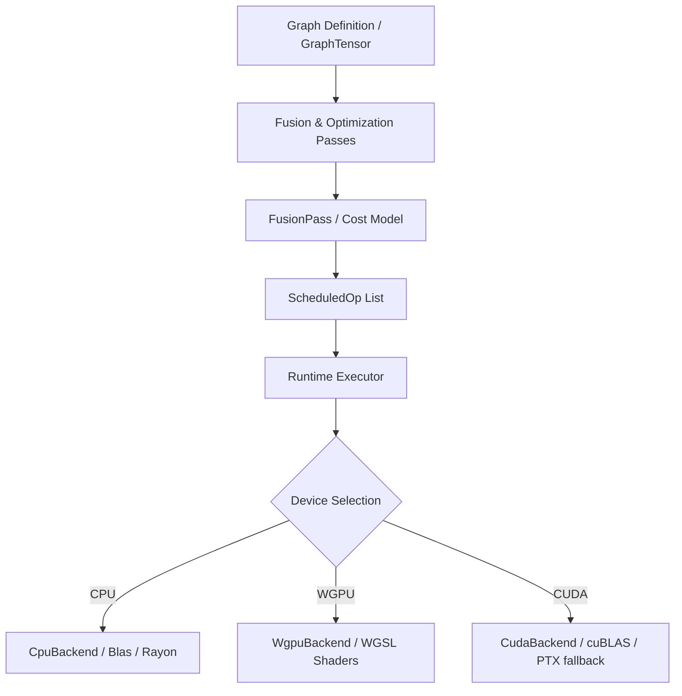

# Aether Developer Onboarding Guide

Welcome to the **Aether** runtime codebase. Aether is a high-performance, heterogeneous compute runtime for machine learning models (specifically targeting GGUF LLMs) with dynamic AST compilation, automatic operator fusion scheduling, and parallel execution.

This document serves as an onboarding guide to help you understand the architecture, design choices, and implementation details of Aether.

---

## 1. Architecture Overview

Aether is designed around a **Dataflow Graph (DAG)** where operations (nodes) represent tensor transformations, and edges represent tensor dependencies. The runtime compiles, optimizes, and executes this graph heterogeneously across CPU and GPU backends.



Key features of the Aether architecture include:
1. **Heterogeneous Device Boundary Crossing**: Transparent fallback and data transfers between host (CPU) and device (GPU).
2. **Buffer Registry with LRU Cache**: Active memory management that keeps hot buffers on the GPU, handles pinning to prevent eviction during execution, and frees intermediate outputs as soon as their dependencies are fully satisfied.
3. **Dynamic AST Compilation**: Elementwise operations are compiled into unified kernels at runtime to minimize memory bandwidth bottlenecks.
4. **Parallel Graph Dispatch**: Rayon-based multi-threaded scheduler that executes independent tasks concurrently.

---

## 2. Component Breakdown

### A. Graph Representation (`src/graph.rs` & `src/tensor.rs`)
- `GraphTensor`: The developer-facing handle representing a tensor in the graph. Operations on `GraphTensor` (like `.matmul()`, `.add()`, `.relu()`) append nodes to the underlying graph.
- `Op`: Enum listing all primitive operations (e.g. `MatMul`, `Add`, `Relu`, `Softmax`, `LayerNorm`, etc.).

### B. Memory & Cache Management (`src/memory/registry.rs`)
- `BufferRegistry`: Maintains the physical allocation mappings for active tensors. It tracks whether data resides in CPU memory, GPU buffers (`wgpu::Buffer`), or both.
- **LRU Eviction**: To prevent GPU out-of-memory (OOM) errors, the registry implements an LRU cache. If allocating a new buffer exceeds the memory budget, inactive buffers are evicted back to host memory.
- **Pinning**: During execution, active input tensors must be *pinned* using `registry.pin(...)` to protect them from being evicted while compute shaders are executing on other threads. Tensors are *unpinned* via `registry.unpin(...)` once the step completes.

### C. Parallel Dispatch (`src/runtime.rs`)
Aether leverages **Rayon** to execute independent operations concurrently:
- We compute the in-degrees of all scheduled tasks based on the availability of their input buffers.
- An execution loop tracks unresolved dependencies using atomic counters.
- Tasks whose dependencies reach `0` are dispatched immediately to the Rayon thread pool.
- Reference counts for consumed intermediate buffers are decremented; when they reach `0`, the buffers are freed or returned to the memory pool.

### D. Operator Fusion Pass (`src/scheduler/fusion.rs`)
To reduce host-device roundtrips, Aether performs static operator fusion:
- **Cost Model**: Evaluates memory bandwidth vs math GFLOPS to decide if fusing operations is beneficial (e.g., if memory transfer time saved exceeds the overhead of a fused compute shader).
- **Supported Fusions**:
  - `MatMul` + `Relu` $\rightarrow$ `MatMulRelu`
  - `MatMul` + `Add` $\rightarrow$ `MatMulAdd`
  - `MatMul` + `Add` + `Relu` $\rightarrow$ `MatMulAddRelu`
  - Arbitrary chains of elementwise operations $\rightarrow$ `ElementwiseChain` (using dynamic WGSL/AST compilation)

### E. Quantization Formats (`src/quant/` & `src/loader/dequant.rs`)
Aether supports standard GGUF K-quantization formats:
- **Q4_K, Q5_K, Q6_K, Q8_0**: Weights are stored in blocked quantized structures.
- **GPU-Side Dequantization**: When a model is loaded, the raw quantized bytes are copied directly to GPU storage buffers. A dequantization compute pass runs on the GPU (`dequantize_on_gpu`) to unpack the weights into `F32` vectors directly in GPU VRAM, bypassing CPU-to-GPU bandwidth bottlenecks.
- **Q5_K Sign-Flip Fix**: Unlike Q6_K which uses signed scales, Q5_K dequantizes using unsigned scales/offsets offset via $d \times \text{sc} - d_{\text{min}} \times \text{mm}$. The high bits are parsed using separate indices, preventing sign-flipping and value distortion.

---

## 3. Getting Started for Developers

### Prerequisites
- Rust (latest stable toolchain).
- Vulkan, Metal, or DX12 driver (for the WGPU backend).

### Compilation and Testing
Run the complete correctness suite to ensure all CPU and GPU behaviors are functional:
```bash
cargo test
```

To run benchmarks:
```bash
cargo bench
```

To run a specific quantization test binary:
```bash
cargo run --bin test_q6k_kernel
```

### Writing New Shaders
All compute shaders are written in WGSL and reside in `src/backend/wgpu_backend/wgsl_shaders.rs`. When introducing a new operation or fused kernel:
1. Define the WGSL source as a string literal.
2. Add the pipeline compile step inside `WgpuBackendInner::new()`.
3. Add a corresponding `execute_[op]_buffers` helper in `WgpuBackend` to bind resources and dispatch workgroups.
